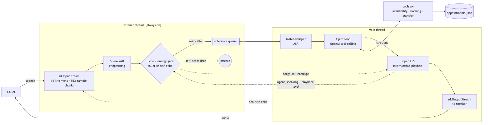
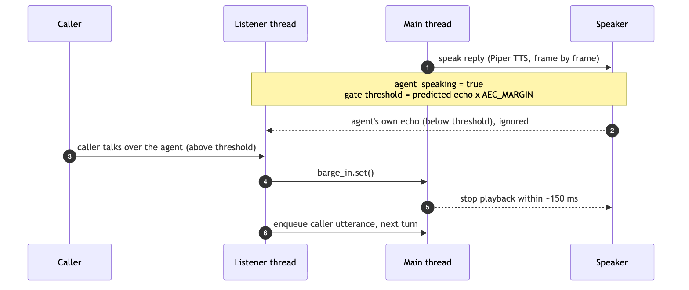

# 🦷 AI Voice Receptionist

A complete, real-time, **full-duplex** voice receptionist built from scratch in Python. It listens,
transcribes, reasons, **books appointments**, and talks back through neural text-to-speech — and you
can **interrupt it mid-sentence**, just like a real phone call.

Speech recognition, voice activity detection, and text-to-speech all run **locally**; only the
language model call is remote. The codebase is split so that a project-agnostic voice **engine** is
reused as-is, and the receptionist is just two "slots" plugged into it:

- **Persona** (`receptionist.py` → `PERSONA`) — who the agent is and how it speaks.
- **Tools** (`receptionist.py` → `TOOLS` + `tools.py`) — what it can actually do.

Swap those two and the same engine becomes any other voice agent.

---

## ✨ Highlights

- **Full-duplex, real-time loop** — an always-on listener thread captures speech while a separate
  thread speaks, so the caller and the agent can talk at the same time.
- **Sub-200 ms barge-in** — talk over the agent and it stops almost instantly and takes your turn.
- **Echo-aware self-voice gating** — works on **open speakers**, not just headphones. A startup
  calibration measures speaker-to-mic echo coupling; at runtime the agent predicts its own echo and
  refuses to transcribe its own voice as a caller.
- **LLM tool-calling agent** — checks availability, books appointments (with double-booking guards),
  and escalates to a human, all via an OpenAI tool-use loop.
- **Production-minded** — graceful retries/fallbacks, per-stage latency metrics (p50/p95), and a
  crash-free shutdown path for native audio threads.
- **Reusable architecture** — swap persona + tools to repurpose the engine for any voice assistant.

---

## 🏗️ Architecture



> Diagram sources live in [`docs/`](docs/) (`.mmd` + `.svg`); regenerate with
> `mmdc -i docs/architecture.mmd -o docs/architecture.svg`.

**The two threads share three signals** (`threading.Event`s): `agent_speaking` (TTS is playing),
`barge_in` (caller interrupted), and `stop` (clean shutdown). The dotted lines are the echo-control
loop: TTS publishes how loud it's currently playing, the gate predicts the resulting echo, and a
genuine interruption raises `barge_in` to cut playback off.

### A turn, and a barge-in



---

## 🔁 How it works

1. **Capture & endpoint.** The listener streams the mic in 32 ms chunks. Silero VAD decides when an
   utterance starts and — after `SILENCE_MS` of trailing silence — when it ends, then hands the
   buffered audio off.
2. **Echo gate.** While the agent is speaking (or in the ~300 ms echo tail), the listener compares
   input energy against the *predicted* echo (`echo_gain × current playback level`). Audio that
   never rises above that prediction is the agent's own voice and is **discarded**; audio that
   clearly exceeds it is a real caller — kept, and used to **interrupt** playback.
3. **Transcribe.** faster-whisper turns the accepted utterance into text.
4. **Reason & act.** The agent loop calls OpenAI with the tool schemas; it runs `tool_use →
   tool_result` rounds (booking, availability, transfer) until it produces a spoken reply.
5. **Speak, interruptibly.** Piper synthesizes the reply and streams it to the speaker in small
   frames, checking `barge_in` between each — so an interruption stops it almost immediately.

A second, content-based guard backs up the acoustic gate: if a transcript closely matches what the
agent just said, it's dropped as self-echo.

---

## 📦 Project structure

| File | Role |
|------|------|
| `engine.py` | The reusable voice pipeline: mic + VAD, ASR, interruptible TTS, barge-in, echo calibration, resilience + timing. **Project-agnostic.** |
| `receptionist.py` | The app: persona, tool schemas, the agent loop, and `main()`. **Run this.** |
| `tools.py` | Receptionist capabilities — business info, availability, booking, transfer. Appointments persist to `appointments.json`. |
| `requirements.txt` | Python dependencies. |
| `.env.example` | Template for your API key, model, and tuning knobs. |

---

## ✅ Prerequisites

- **Python 3.9+**
- A microphone and speakers (headphones optional — echo is handled, see [Troubleshooting](#-troubleshooting))
- An **OpenAI API key**
- **Apple Silicon (M1/M2/M3): everything must run as native `arm64`.** Two traps:
  1. An x86_64 Python (e.g. Homebrew under `/usr/local`) runs the ML/audio libraries under Rosetta,
     which lacks AVX → `illegal hardware instruction` (SIGILL). Use an arm64 interpreter;
     `/usr/bin/python3` is a fine choice.
  2. Even with an arm64 venv, a **Terminal running under Rosetta** makes the universal `python`
     binary launch as x86_64 (it inherits the shell's architecture) and then can't load the arm64
     wheels. Check with `arch` — it must print `arm64`, not `i386`/`x86_64`. If it's wrong, run
     `exec arch -arm64 zsh`, or uncheck **"Open using Rosetta"** in the terminal's Get Info. One-shot
     override: `arch -arm64 .venv/bin/python receptionist.py`.

  Confirm at any time: `python -c "import platform; print(platform.machine())"` → `arm64`.

---

## 🚀 Setup

**1. Install dependencies** (a virtual environment is recommended; on Apple Silicon create it with a
native arm64 interpreter):

```bash
/usr/bin/python3 -m venv .venv        # arm64 on Apple Silicon
source .venv/bin/activate
pip install -r requirements.txt
```

**2. Download a Piper voice model** — two files (`.onnx` + `.onnx.json`) in this folder. The default
is `en_US-lessac-medium`. Grab it from the Piper voices collection (search "piper voices
huggingface"):

```bash
base="https://huggingface.co/rhasspy/piper-voices/resolve/main/en/en_US/lessac/medium"
curl -L -o en_US-lessac-medium.onnx      "$base/en_US-lessac-medium.onnx"
curl -L -o en_US-lessac-medium.onnx.json "$base/en_US-lessac-medium.onnx.json"
# or point PIPER_MODEL at your own voice
```

**3. Configure your key and model** — copy the template and fill it in:

```bash
cp .env.example .env
# edit .env:
#   OPENAI_API_KEY=sk-...
#   OPENAI_MODEL=gpt-5.4-mini   # optional; any tool-calling chat model works
```

`.env` is loaded automatically at startup (via `python-dotenv`) — no `export` needed.

---

## ▶️ Run it

```bash
python receptionist.py
```

It plays a short calibration tone, greets you, and starts listening. Then just talk:

| You say | What happens |
|---|---|
| *"What are your hours?"* | Answered from the business facts in the persona. |
| *"What's open on Friday?"* | Calls `check_availability`. |
| *"Book me a cleaning Friday at 2 PM, my name's Sam."* | Confirms, then calls `book_appointment`. |
| *"I have a dental emergency."* | Calls `transfer_to_human`. |

Open `appointments.json` to see what got booked. **Talk over the receptionist** while it's speaking —
it should stop instantly and treat your interruption as the next turn.

Press **Ctrl+C** to quit. On exit it prints a per-stage latency summary (count, p50, p95) for `asr`
(transcription) and `agent_turn` (the LLM) — these time *compute*, not the time you spend talking —
and shuts the audio threads down cleanly.

---

## ⚙️ Configuration

All knobs are environment variables (set them in `.env` or the shell). Sensible defaults ship in code.

| Variable | Default | What it does |
|---|---|---|
| `OPENAI_API_KEY` | — | **Required.** Your OpenAI key. |
| `OPENAI_MODEL` | `gpt-5.4-mini` | LLM for the agent loop. Any tool-calling chat model. |
| `PIPER_MODEL` | `en_US-lessac-medium.onnx` | Path to the Piper voice model. |
| `ASR_MODEL` | `base.en` | Whisper size: `tiny.en` < `base.en` < `small.en` (speed ↔ accuracy). |
| `SILENCE_MS` | `900` | Trailing silence before your turn ends. Lower = snappier; higher = more patient. |
| `CALIBRATE` | `1` | Play the startup probe tone to measure echo coupling. `0` to skip. |
| `AEC_MARGIN` | `2.5` | How far above predicted echo input must rise to count as a real caller. |
| `ECHO_TAIL_DECAY` | `0.85` | Per-chunk decay of the echo estimate after playback stops (covers the tail). |
| `BARGE_RMS_MIN` | `0.015` | Absolute energy floor to register a barge-in. |
| `BARGE_FACTOR` | `3.0` | …or this multiple of the measured room noise floor. |
| `BARGE_CHUNKS` | `4` | Consecutive loud frames (~130 ms) needed to trigger barge-in. |
| `APPOINTMENTS_DB` | `appointments.json` | Where bookings are stored. |
| `RX_DEBUG` | `0` | `1` prints per-utterance gate verdicts (accept / discard self-echo). |

---

## 🛠️ Customizing

- **Change the business:** edit `BUSINESS` and `SLOTS` in `tools.py`.
- **Change the personality:** edit `PERSONA` in `receptionist.py`. Every line fights a specific bad
  default (long answers, markdown, robotic phrasing) — change the tone, keep the spoken-style rules.
- **Add a tool:** add a schema to `TOOLS`, an implementation in `tools.py`, and one line to
  `TOOLS_IMPL`. The agent loop handles the rest.

---

## 🔍 Troubleshooting

- **Can't interrupt it / it talks over you.** Barge-in uses an energy gate while the receptionist
  speaks. If it ignores you, your mic is quiet — lower `BARGE_RMS_MIN` (e.g. `0.008`) or `BARGE_FACTOR`.
- **Echo / it interrupts itself.** Handled in two stages so you don't need headphones: a startup probe
  tone **measures speaker→mic echo coupling**, then while speaking it **predicts its own echo** and
  only treats the mic as a caller when input rises `AEC_MARGIN`× above that prediction. If it still
  self-interrupts on a very loud speaker, raise `AEC_MARGIN`; if it ignores you, lower it. Set
  `RX_DEBUG=1` to watch the gate verdicts. The strongest production fix is true acoustic echo
  cancellation (see [Roadmap](#-roadmap)).
- **`Piper voice model not found`.** Download the `.onnx` + `.onnx.json` files (Setup step 2) or set
  `PIPER_MODEL`.
- **Piper API errors on `synthesize`.** `piper-tts` has changed its API across versions; `engine.py`
  targets the current one and falls back to the older `synthesize_stream_raw`. Check your version with
  `pip show piper-tts`.
- **No audio devices.** `python -c "import sounddevice; print(sounddevice.query_devices())"` lists
  them; make sure a default input and output exist.
- **`OPENAI_API_KEY` not set.** Put it in `.env` (Setup step 3) or export it.
- **`illegal hardware instruction` (SIGILL) on Apple Silicon.** You're running x86 under Rosetta — see
  [Prerequisites](#-prerequisites).

---

## 🗺️ Roadmap

- **Stream the LLM** for even lower latency on longer replies.
- **Real database** instead of `appointments.json` (Postgres, SQLite) for multi-user.
- **Browser or phone front-end** — stream mic audio over WebSocket to this backend; for phone, put it
  behind a telephony provider. Frameworks like Pipecat or LiveKit handle transport and scaling.
- **True echo cancellation** for loud speakerphone — on mobile it's free from the OS (iOS
  `AVAudioSession` `.voiceChat`, Android `AcousticEchoCanceler`); in the browser use
  `getUserMedia({ audio: { echoCancellation: true } })`; on desktop, run the mic through a
  WebRTC/SpeexDSP AEC (with the TTS output as the reference) before the VAD.
- **Guardrails** — confirm before irreversible actions, moderate input/output, validate tool args.

---

## 🧰 Tech stack

Python · OpenAI API (tool calling) · faster-whisper (ASR) · Silero VAD · Piper TTS ·
sounddevice / PortAudio · NumPy · threading
